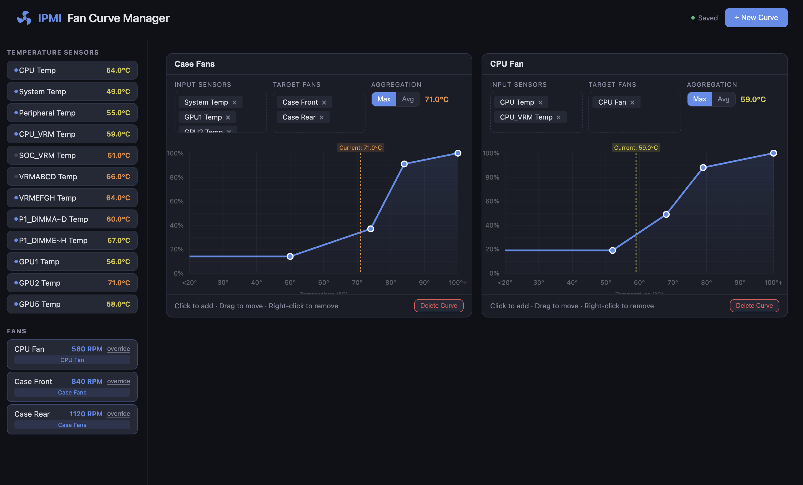

# IPMI Fan Curve Manager

A web UI for managing server fan curves via IPMI. Define temperature-to-fan-speed curves with an interactive chart, assign sensors and fans, and let the daemon apply speeds automatically.



## Features

- Drag temperature sensors and fans onto curves
- Interactive chart — click to add points, drag to adjust, double-click to remove
- Monotonic curve enforcement (fan speed never decreases as temp rises)
- Live sensor readings with color-coded temperatures
- Aggregation toggle (max / average) per curve
- Automatic fan speed control loop (polls every 60s)
- Mock mode for testing without IPMI hardware
- Prometheus metrics exported to /metrics

## Usage

1. **Create a curve** — click "+ New Curve"
2. **Drag sensors** from the left sidebar into the "Input Sensors" drop zone
3. **Drag fans** into the "Target Fans" drop zone
4. **Set aggregation** — toggle between Max and Average
5. **Edit the curve** — click on the chart to add points, drag them to adjust, right-click to remove


The control loop reads the assigned sensors, computes the aggregated temperature, interpolates the fan percentage from the curve, and applies it via `ipmitool raw` commands.

## Docker Compose

```yaml
services:
  ipmi-fan-curve:
    image: ghcr.io/OWNER/ipmi-fan-curve:latest
    ports:
      - "8777:8777"
    volumes:
      - ./ipmi_fan_curve:/data
    environment:
      - POLL_INTERVAL=30 # Optional, default 30
    devices:
      - /dev/ipmi0:/dev/ipmi0
    restart: unless-stopped
```

The compose file maps `/dev/ipmi0` into the container. Edit the `devices` entry if your IPMI device path differs.

## IPMI Compatibility

Fan speed control uses SuperMicro-style raw commands:

```
raw 0x30 0x30 0x01 0x00        # enable manual fan control
raw 0x30 0x30 0x02 0x00 0xNN   # set zone 0 duty cycle
```

Edit `ipmi.py` `set_fan_speed()` if your BMC uses different commands.

## Metrics

Prometheus metrics are exposed at `GET /metrics` (real IPMI backend only; mock mode returns empty).

| Metric | Type | Labels | Description |
|--------|------|--------|-------------|
| `ipmi_temperature_celsius` | Gauge | `sensor` | Temperature sensor reading in °C |
| `ipmi_fan_speed_rpm` | Gauge | `fan` | Fan speed in RPM |
| `ipmi_fan_duty_percent` | Gauge | `curve`, `fan` | Computed fan duty cycle from curve (or `OVERRIDE` for manual overrides) |
| `ipmi_curve_temperature_celsius` | Gauge | `curve` | Aggregated input temperature for a curve |
| `ipmi_poll_age_seconds` | Gauge | — | Seconds since last successful sensor poll |

## Local Development

### Configuration

| Flag / Env | Default | Description |
|------------|---------|-------------|
| `--mock` | off | Use simulated sensors |
| `--port` | 8777 | HTTP port |
| `POLL_INTERVAL` | 30 | Seconds between sensor polls |

### Mock mode (no IPMI hardware needed)

```bash
pip install -r requirements.txt
python server.py --mock
```

Open http://localhost:8777

### Real IPMI

Requires `ipmitool` installed and `/dev/ipmi0` accessible:

```bash
pip install -r requirements.txt
sudo python server.py
```
